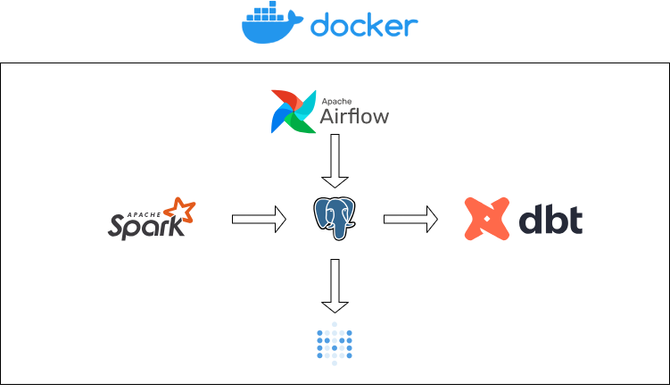
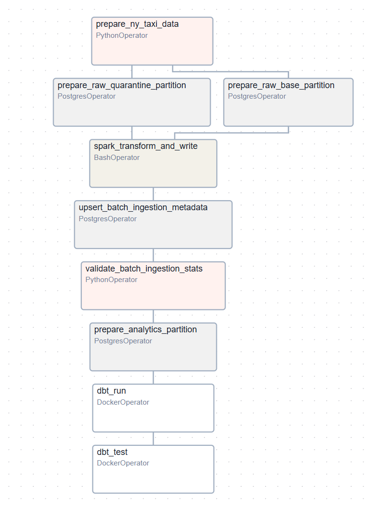
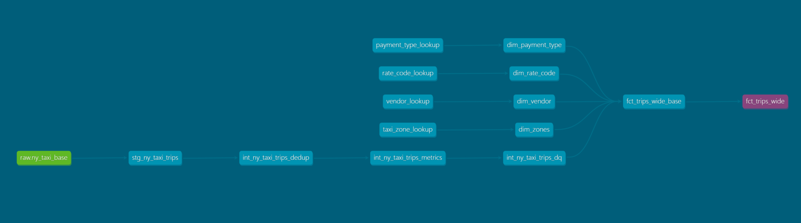
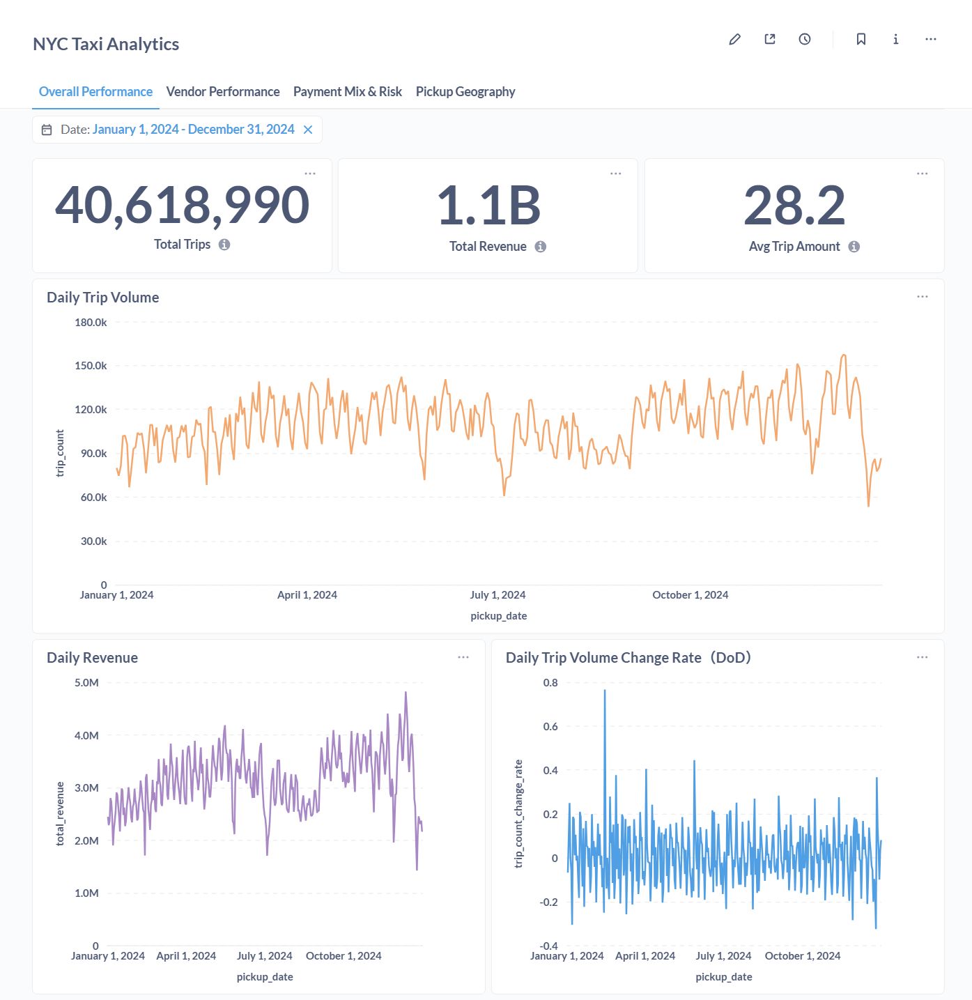

# NYC Taxi Batch ELT Platform

[](LICENSE) 
[](https://github.com/shutiansong/nyc-taxi-data-platform)
[](https://github.com/shutiansong/nyc-taxi-data-platform)

[](https://www.docker.com/)
[](https://airflow.apache.org/)
[](https://spark.apache.org/)
[](https://www.getdbt.com/)
[](https://www.postgresql.org/)
[](https://www.metabase.com/)


A production-style **batch ELT data platform built around the NYC Taxi trip dataset**, emphasizing **deterministic batch processing, explicit data quality signaling, and safe reruns**. Fully **containerized** for reproducibility and modular orchestration.

---

# Table of Contents

1. [Architecture Overview](#architecture-overview)
2. [Technology Stack](#technology-stack)
3. [Repository Structure](#repository-structure)
4. [Batch Semantics & Determinism](#batch-semantics--determinism)
5. [Pipeline Orchestration (Airflow)](#pipeline-orchestration-airflow)
6. [Raw ELT Layer (Spark)](#raw-elt-layer-spark)
7. [dbt Transformation Layer](#dbt-transformation-layer)
8. [Analytics Dashboards](#analytics-dashboards-metabase)
9. [Design Principles](#design-principles)
10. [Lessons Learned](#lessons-learned)
11. [Summary](#summary)

---

# Architecture Overview

<p align="center">
  
</p>

**Pipeline Flow**

Raw Parquet Data (Monthly) → Spark Batch ELT → PostgreSQL Warehouse → dbt Transformation → Metabase Dashboards

All components run as isolated **Docker containers** orchestrated via **Docker Compose**, ensuring reproducibility, modularity, and safe local deployment.

---

# Technology Stack

| Layer | Technology |
|------|------------|
| Orchestration | Apache Airflow |
| Processing | Apache Spark (PySpark) |
| Warehouse | PostgreSQL |
| Transformation | dbt |
| BI / Visualization | Metabase |
| Infrastructure | Docker Compose |
| Data Source | NYC Yellow Taxi Trip Data (2024 full-year dataset, monthly Parquet) |

---

# Repository Structure

The structure below reflects the original project layout used during development.  
Only documentation and screenshots are included in this public repository.

```text
nyc-taxi-data-platform
│
├── airflow/                          # Airflow orchestration environment
│   ├── dags/
│   │   ├── utils/                    # DAG helper utilities
│   │   └── ny_taxi_monthly_ingestion_dag.py
│   │
│   ├── sql/
│   │   └── upsert_batch_ingestion_stats.sql   # metadata upsert logic
│   │
│   ├── Dockerfile
│   ├── docker-compose.yaml
│   ├── requirements.txt
│   ├── .env
│   │
│   ├── config/                       # Airflow configuration
│   ├── logs/                         # Airflow runtime logs
│   └── plugins/                      # Airflow plugins
│
├── spark/                            # Spark processing container
│   ├── Dockerfile
│   ├── docker-compose.yaml
│   ├── requirements.txt
│   └── .env
│
├── jobs/                             # Spark batch ELT scripts
│   ├── ny_taxi_elt.py
│   └── utils/
│
├── warehouse/                        # PostgreSQL warehouse bootstrap
│   ├── docker-compose.yaml
│   └── ddl/                          # One-time schema creation
│       └── *.sql
│
├── dbt/                              # dbt transformation project
│   ├── ny_taxi_rides/
│   │   ├── models/                   # staging / intermediate / analytics
│   │   ├── seeds/
│   │   ├── macros/
│   │   ├── tests/
│   │   └── dbt_project.yml
│   │
│   ├── profiles.yml                  # dbt connection profiles
│   ├── Dockerfile
│   └── docker-compose.yaml
│
├── metabase/                         # BI dashboard container
│   ├── docker-compose.yaml
│   └── pg_data/                      # Metabase metadata database volume
│
├── data/                             # Local data storage
│   ├── raw/                          # downloaded NYC taxi parquet files
│   └── warehouse/                    # PostgreSQL volume mount
│
└── screenshots/                      # Architecture / DAG / Lineage / Dashboard images
```

---

# Batch Semantics & Determinism

- Data processed in **monthly batches (YYYY-MM)**  

### Safe Reruns

- Full snapshot replacement  
- Partial failures do not corrupt historical data  

### Late / Early Trip Handling

| Category | Handling |
|----------|----------|
| Clean | Base table |
| Suspicious | Base + Quarantine |
| Critical | Quarantine only |

---

# Pipeline Orchestration (Airflow)

Airflow orchestrates the full batch pipeline, coordinating ingestion, transformation, and validation tasks.

Key responsibilities include:

- batch scheduling  
- dependency management  
- safe pipeline reruns  
- operational monitoring  

Example DAG structure:

<p align="center">
  
</p>

---

# Raw ELT Layer (Spark)

The Spark layer handles:

- Monthly batch ingestion of raw Parquet datasets  
- Centralized data quality validation: time, pricing, passenger anomalies  
- Classification: clean → base, suspicious → base + quarantine, critical → quarantine  

**Loading strategy**

- `partition + truncate + rewrite` ensures safe partition refreshes while preventing table bloat

### Batch Observability

Each ingestion batch records operational metadata for auditing and monitoring:

- input row count  
- base table output rows  
- quarantine table rows  
- DQ issue distribution  
- pickup timestamp ranges  

These metrics are stored in:

`metadata.batch_ingestion_stats`


This enables batch-level auditing, anomaly detection, operational monitoring, and safe pipeline reruns.

---

# dbt Transformation Layer

dbt builds analytics-ready models on top of Spark-processed data.

### Staging Layer

- Standardizes column naming  
- Provides stable interface over raw tables  

### Intermediate Layer

- Trip deduplication  
- Metric derivation  
- Data quality signals  

### Dimension Tables

- dim_vendor  
- dim_rate_code  
- dim_payment_type  
- dim_zones  

### Fact Tables

- fct_trips_wide  
- fct_trips_daily_vendor  
- fct_trips_daily_pickup_zone  
- fct_trips_daily_payment_type  

**Incremental & Partitioning Strategy**

- Incremental materialization scoped by `pickup_month`  
- Only affects current partition for reruns  
- Partition-aware dbt tests improve performance (~15 → 8–9 min)  
- External storage reduced from ~100GB → <50MB  

<p align="center">
  
</p>

---

# Analytics Dashboards (Metabase)

Dashboards provide:

- Trip volume and revenue  
- Vendor performance trends  
- Payment type distribution and tip rates  
- Pickup-zone spatial analytics  

<p align="center">
  
</p>

---

# Design Principles

| Principle | Implementation |
|-----------|----------------|
| Correctness over throughput | Batch processing (~15 min per batch) |
| Deterministic ELT snapshots | Partition + truncate + rewrite |
| Explicit DQ signaling | DQ flags instead of filtering |
| Separation of layers | Spark ingestion vs dbt analytics |

---

# Lessons Learned

- Late-arriving data requires explicit classification  
- Partitioning improves rerun efficiency and storage management  
- Operational metadata is critical for debugging  
- Clear separation of ingestion and transformation improves maintainability  

---

# Summary

- Production-style **safe, re-runnable batch ELT pipeline**
- Treats **data quality as analytical output**
- Fully **containerized stack**: Airflow, Spark, dbt, PostgreSQL, Metabase
- Optimized for reproducibility, modularity, and performance
