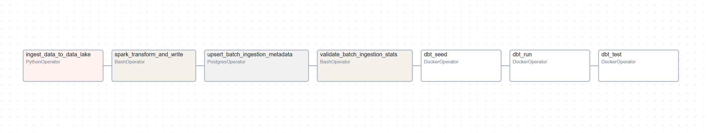
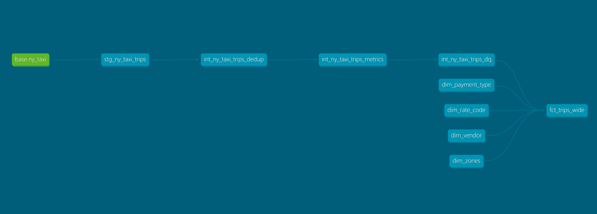

# NYC Taxi Batch ELT Platform V2

[](LICENSE)
[](https://github.com/shutiansong/nyc-taxi-data-platform)
[](https://github.com/shutiansong/nyc-taxi-data-platform)

[](https://www.docker.com/)
[](https://airflow.apache.org/)
[](https://spark.apache.org/)
[](https://min.io/)
[](https://www.postgresql.org/)
[](https://www.starrocks.io/)
[](https://www.getdbt.com/)
[](https://www.metabase.com/)


A production-style **batch ELT data platform built around the NYC Taxi trip dataset**, evolved from a PostgreSQL-centered V1 pipeline into a storage-separated V2 architecture using object storage and an OLAP warehouse.

The platform focuses on **deterministic batch processing, data quality handling, idempotent reruns, operational metadata, and analytical scalability**.

The project is fully containerized with **Docker Compose**. The public repository focuses on architecture, documentation, configuration references, and workflow screenshots rather than exposing the complete implementation code.

---

# Table of Contents

1. [Architecture & Evolution](#architecture--evolution)
2. [Technology Stack](#technology-stack)
3. [Repository Structure](#repository-structure)
4. [Batch Processing & Data Quality](#batch-processing--data-quality)
5. [Analytical Modeling](#analytical-modeling)
6. [Operational Metadata](#operational-metadata)
7. [Performance](#performance)
8. [Lessons Learned](#lessons-learned)
9. [Summary](#summary)

---

# Architecture & Evolution

The project evolved from a PostgreSQL-centered V1 batch ELT pipeline into a storage-separated V2 architecture.

In V1, PostgreSQL was used as both the primary data store and analytical warehouse. The V1 implementation was first optimized for rerun behavior, dbt test performance, and PostgreSQL storage pressure.

V2 then separated durable data storage from analytical serving. MinIO stores Parquet datasets, StarRocks provides the analytical warehouse layer, and Postgres is retained for operational metadata.

## V1 Architecture

````text
NYC Taxi Monthly Parquet
          │
          ▼
       Local Disk
          │
          ▼
      Spark Batch ELT
          │
          ▼
       Postgres
   Base / Quarantine / Metadata
          │
          ▼
          dbt
          │
          ▼
   Analytics Models
          │
          ▼
       Metabase
````

## V2 Architecture

```text
NYC Taxi Monthly Parquet
          │
          ▼
       MinIO Raw
          │
          ▼
    Spark Batch ELT
       │       │
       │       └──────────────► Postgres
       │                         Metadata
       ▼
 MinIO Base / Quarantine
          │
          ▼
 StarRocks External Tables
          │
          ▼
         dbt
          │
          ▼
   Analytics Models
          │
          ▼
      Metabase
```

The processing flow is:

**Parquet → MinIO Raw → Spark → MinIO Base/Quarantine + Postgres Metadata → StarRocks External Tables → dbt → Analytics → Metabase**

The V2 architecture separates durable Parquet storage from analytical serving while keeping the existing batch semantics and analytical models.

| | V1 | V2 |
|---|---|---|
| Data Storage | Postgres | MinIO / Parquet |
| Analytical Warehouse | Postgres | StarRocks |
| Operational Metadata | Postgres | Postgres |
| Transformation | dbt | dbt |
| BI | Metabase | Metabase |
| End-to-End Runtime | ~15 min | ~3 min |

The original V1 documentation is preserved under `docs/v1/README.md`.

---

# Technology Stack

| Layer | Technology |
|------|------------|
| Orchestration | Apache Airflow |
| Processing | Apache Spark / PySpark |
| Object Storage | MinIO |
| Metadata Store | Postgres |
| Analytical Warehouse | StarRocks |
| Transformation | dbt |
| BI / Visualization | Metabase |
| Infrastructure | Docker Compose |
| Data Format | Parquet |
| Data Source | NYC Yellow Taxi Trip Data |

---

# Repository Structure

The V2 project is organized as independently containerized services.

```text
project-root/
│
├── airflow/
│   ├── Dockerfile
│   ├── config/
│   ├── dags/
│   ├── docker-compose.yaml
│   ├── logs/
│   ├── plugins/
│   ├── requirements.txt
│   └── sql/
│
├── spark/
│   ├── Dockerfile
│   ├── conf/
│   ├── docker-compose.yaml
│   ├── jobs/
│   └── requirements.txt
│
├── minio/
│   ├── data/
│   └── docker-compose.yaml
│
├── postgres/
│   ├── ddl/
│   └── docker-compose.yaml
│
├── starrocks/
│   ├── data/
│   ├── ddl/
│   └── docker-compose.yaml
│
├── dbt/
│   ├── Dockerfile
│   ├── docker-compose.yaml
│   ├── logs/
│   ├── ny_taxi_rides/
│   ├── ny_taxi_rides_v2/
│   └── profiles.yml
│
└── metabase/
    ├── docker-compose.yaml
    ├── pg_data/
    └── plugins/
```

Airflow, Spark, and dbt each have their own Dockerfile and Docker Compose configuration. The remaining services are defined through their respective Docker Compose configurations.

The public GitHub repository focuses on **architecture, documentation, configuration references, and workflow screenshots** rather than exposing the complete implementation code.

The original V1 documentation remains available separately under `docs/v1/README.md`.

---

# Batch Processing & Data Quality

The pipeline processes NYC Taxi data as deterministic monthly batches.

```text
batch_id = YYYY-MM
```

For example:

```text
2024-01
2024-02
2024-03
...
2024-12
```

The same `batch_id` represents the same logical processing unit throughout the pipeline.

This provides a consistent basis for:

- idempotent reruns
- historical backfills
- partition-level replacement
- batch-level validation
- operational metadata tracking

Raw monthly Parquet files are first written to MinIO:

```text
s3a://<bucket>/raw/<batch_id>/
```

Spark reads the corresponding raw batch, performs data cleansing and quality validation, and writes the processed datasets back to MinIO.

Each record is classified into one of three quality states:

| Quality Status | Destination |
|----------------|-------------|
| Clean | Base |
| Suspicious | Base + Quarantine |
| Critical | Quarantine |

Rather than silently filtering anomalous records, the pipeline preserves them in the appropriate storage layer and carries the data quality signal downstream.

This makes data quality issues traceable and auditable while keeping the processing result available for investigation.

<p align="center">
  
</p>

---

# Analytical Modeling

StarRocks exposes the processed Parquet datasets stored in MinIO through external tables.

dbt performs the downstream transformations directly in StarRocks:

```text
Processed Data
      │
      ▼
   Staging
      │
      ▼
 Intermediate
      │
      ▼
  Analytics
```

The dbt project separates source preparation, business transformations, and analytical models.

The final analytical layer contains models such as:

```text
dim_vendor
dim_rate_code
dim_payment_type
dim_zones

fct_trips_wide
fct_trips_daily_vendor
fct_trips_daily_pickup_zone
fct_trips_daily_payment_type
```

These models support analytical use cases including trip volume, revenue, vendor performance, payment behavior, and pickup-zone analysis.

<p align="center">
  
</p>

Metabase consumes the final analytical models for BI and visualization.

<p align="center">
  
</p>

---

# Operational Metadata

Operational metadata is stored separately in Postgres rather than in the analytical storage layer.

The main metadata table is:

```text
metadata.batch_ingestion_stats
```

It records batch-level information including:

- input row count
- processed output counts
- Base and Quarantine distributions
- data quality statistics
- minimum pickup timestamp
- maximum pickup timestamp

The metadata supports batch validation, troubleshooting, auditing, and operational monitoring.

Airflow failure callbacks and SLA configuration provide additional task-level failure tracking.

---

# Performance

The V2 architecture significantly reduced the end-to-end pipeline runtime:

| Version | Architecture | Runtime |
|---------|--------------|---------|
| V1 | Spark → Postgres → dbt → Metabase | ~15 min |
| V2 | MinIO → Spark → MinIO → StarRocks → dbt → Metabase | ~3 min |

The V1 implementation was optimized before the V2 migration.

Key V1 improvements included:

- partition-level `TRUNCATE + REWRITE` for rerun-safe loading
- partition-aware dbt tests
- reduced unnecessary full-table scans
- reduced PostgreSQL temporary storage pressure

These changes reduced dbt test time from approximately **15 minutes to 8–9 minutes** and reduced PostgreSQL temporary file usage from approximately **100 GB to less than 50 MB**.

The V2 redesign then addressed the larger architectural limitation by separating durable storage from analytical serving.

---

# Lessons Learned

## 1. Separate durable storage from analytical serving

Object storage is well suited for retaining processed datasets, while an OLAP warehouse can focus on analytical workloads.

This separation reduces coupling between persistent storage and analytical processing.

## 2. Design rerun semantics explicitly

A batch pipeline should define what happens when the same batch is executed again.

Deterministic batch identifiers and partition-level replacement make reruns predictable and prevent duplicate accumulation.

## 3. Preserve data quality signals

Data quality issues should not automatically disappear during ingestion.

Routing anomalous records to quarantine while retaining their quality status makes downstream investigation and auditing possible.

## 4. Optimize before redesigning

The V1 implementation was first optimized around its actual bottlenecks.

The V2 redesign was then introduced to address the architectural limitations that remained after those optimizations.

---

# Summary

NYC Taxi Batch ELT Platform V2 demonstrates a production-style batch data engineering architecture built around:

- **Airflow** for orchestration
- **Spark** for batch processing and data quality
- **MinIO** for Parquet-based object storage
- **Postgres** for operational metadata
- **StarRocks** for analytical serving
- **dbt** for data modeling
- **Metabase** for BI
- **Docker Compose** for containerized deployment

The project evolved from a PostgreSQL-centered V1 pipeline into a storage-separated V2 architecture while preserving deterministic batch processing, data quality handling, and analytical models.

The V2 redesign reduced end-to-end pipeline runtime from approximately **15 minutes to 3 minutes**.
